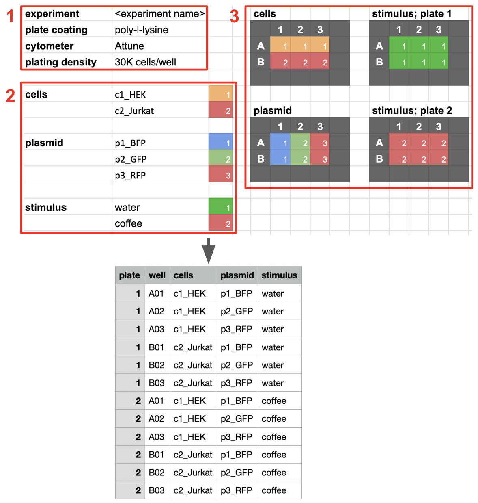

# Install

```bash
pip install skittle-sheets
```

To access private Google Sheets, generate a service account and JSON key file following
https://cloud.google.com/iam/docs/creating-managing-service-account-keys

Place the JSON key file in the working directory, a parent directory, your home directory, or `~/config/skittle`. Make sure the filename matches `*service*.json` (e.g,. move it to `~/config/.skittle_service.json`).

# Format and examples




There are three meaningful blocks that are automatically extracted from the layout based on location. Any other content is ignored, so it's OK to put notes wherever you like.

1. Key value pairs, like `experiment: <experiment_name>`. These must be at the top left of the sheet.
2. Variable definitions. Each must be an Oklahoma-shaped region in the first three columns (variable name, value, and code).
3. Grids mapping variables onto plates. The grid can be anywhere, but the spacing between variable name and row/column labels is important. Fill out the plate with codes (empty cells are OK). Plates labels can be listed after a semicolon (a grid with no plate label applies to all plates).

Here are [some examples](https://docs.google.com/spreadsheets/d/1UVDRgs1w6fySZqJqEbEH1v7m1i0qhhpQ_r9Y59TZ8tU/edit#gid=968744084):

```bash
# example A
skittle export https://docs.google.com/spreadsheets/d/1UVDRgs1w6fySZqJqEbEH1v7m1i0qhhpQ_r9Y59TZ8tU/edit#gid=968744084
# example B (shown above)
skittle export https://docs.google.com/spreadsheets/d/1UVDRgs1w6fySZqJqEbEH1v7m1i0qhhpQ_r9Y59TZ8tU/edit#gid=767021684
# example C
skittle export https://docs.google.com/spreadsheets/d/1UVDRgs1w6fySZqJqEbEH1v7m1i0qhhpQ_r9Y59TZ8tU/edit#gid=1432994532
```

# Usage 

## Public Google Sheets

```bash
skittle export <URL>
```

## Private Google Sheets

Share your Google Sheets document with the service account generated above (read-only is fine). Then run:

```bash
skittle export "<spreadsheet>/<worksheet>"
```

If the Drive and Sheets APIs are not already enabled, there will be an error message with a link prompting you to enable them.

## Local `.csv` file

```bash
skittle export layout.csv
```
